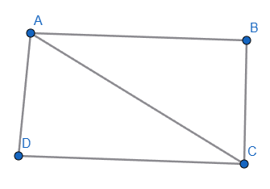
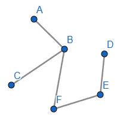
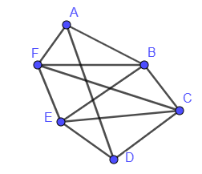
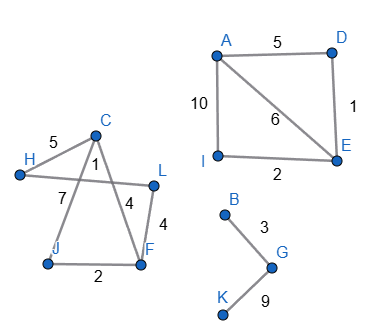
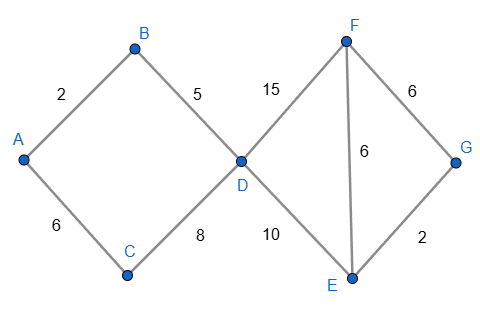

# Gráficas simples

1. abacadbccd

2. abbcbffeed

3. abadafbcbebfcdcecfdeef

# Gráficas simples con pesos

1. ab2 ac1 ad3 bc4 cd1

2. ab1 bc2 bf1 fe2 ed1

3. ab9 ad9 af3 bc1 be6 bf4 cd8 ce5 cf2 de3 ef2

4. ad5 ae6 ai10 de1 ei2 bg3 gk9 ch5 hl1 cj7 cf4 jf2 fl4

5. ab2 ac6 bd5 cd8 df15 de10 ef6 fg6 eg2

